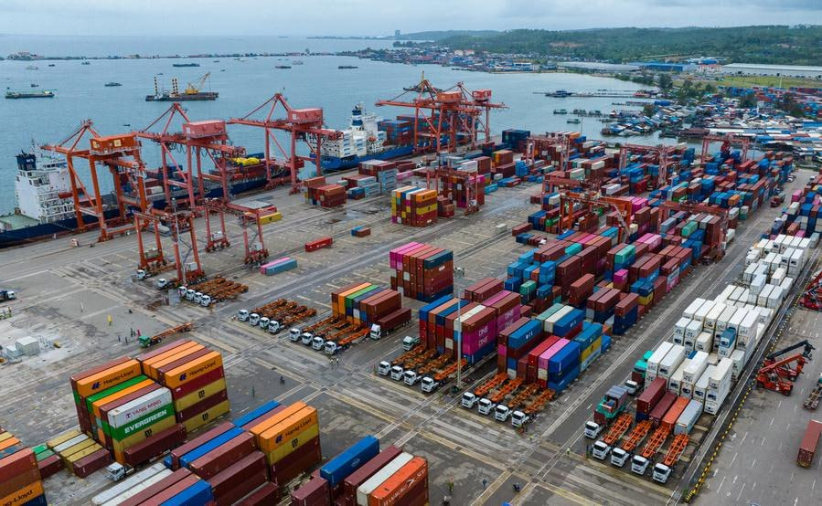
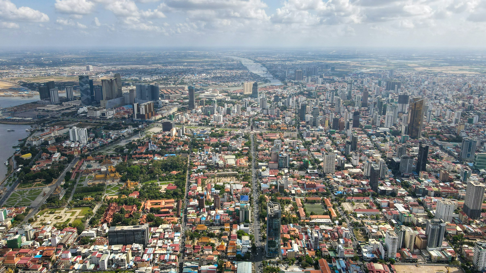
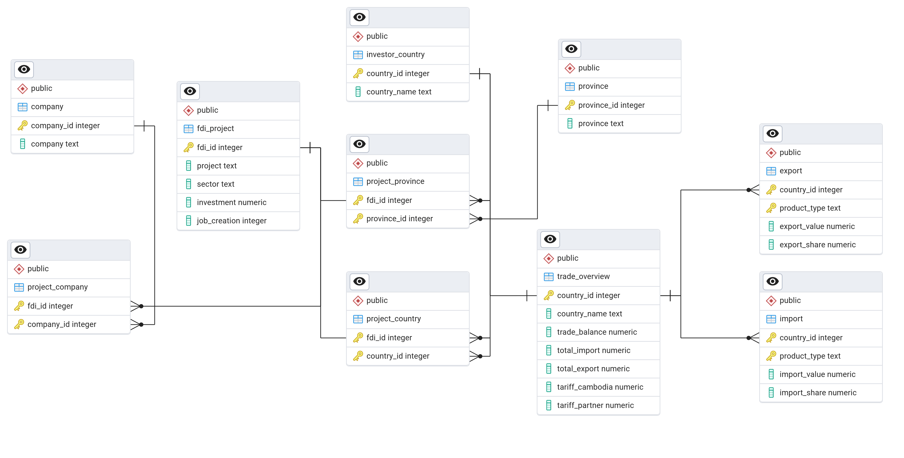

### **Project Overview**

::: {style="text-align: center; padding-top: 10px;"}
<h2 style="font-size: 28px; font-weight: bold; margin-bottom: 20px;">

Foreign Direct Investments & Trade in Cambodia

</h2>
:::

Cambodia is one of the fastest-growing economies in Southeast Asia with a GDP of about \$47.15 billion and an economic growth rate of 5.5% as of 2024. This is partially thanks to the huge inflow of foreign direct investments (FDI) from various countries, such as China, Japan and France. Many sectors of the economy are booming as a result, with potentially hundreds of thousands, if not millions, of job creations.

In this project, I have created a database application that shows these FDIs in Cambodia, along with its international trade relationships with the investor countries. The goal is to explore how these FDI inflows can affect Cambodia's import and export patterns. This application would be useful for researchers, economists and even policymakers who are interested in understanding this aspect of Cambodia's economy.

 

### **Data Collection & Methodology**

::: {style="text-align: center; padding-top: 10px;"}
<h2 style="font-size: 28px; font-weight: bold; margin-bottom: 20px;">

Data Collection & Methodology

</h2>
:::

-   For data, I primarily relied on [OpenDevelopment Cambodia](https://opendevelopmentcambodia.net/profiles/foreign-investment-in-cambodia/) to gather information on all the documented FDIs in the country, as well as [World Integrated Trade Solution (WITS)](https://wits.worldbank.org/countrysnapshot/en/KHM) for details about trade.
-   Both sources were published in 2022. While the former was last updated in 2023, the latter has not been updated since, which is likely due to the World Bank's reliance on official government data (i.e., UN COMTRADE) that can involve extensive validation and processing, leading to delays.
-   For this database, I only selected the top 11 countries that invest the most in Cambodia, which includes China, Japan, France, Singapore, South Korea, Thailand, Vietnam, Malaysia, the United States, as well as Hong Kong and Taiwan. It should be noted that the trade data for Taiwan is not available in WITS because it is not a member of the UN and therefore not included in the UN COMTRADE data. Thus, Taiwan was excluded from the export and import analysis in this project.
-   There were some challenges when working with the FDI data, as many companies did not list their country of origin, while others were registered as being Cambodian-owned despite having clear foreign backing. The reason for this occurring could be to avoid taxes or potential tariffs. I had to manually look up each of these companies to identify their actual country of origin. For those that were too ambiguous or unverifiable, I excluded them from this analysis.
-   I mainly used RStudio to run my codes. I also used pgAdmin4 and Shinyapps to create my database. Some of the important packages I used include DBI, dplyr, RSQLite, shiny, leaflet, RPostgres and ggplot2.

### **Database Schema**

### **Database Application**

::: {style="text-align: center; padding-top: 40px;"}
<a href="cambodia_fdi_db.html" target="_blank" style="
     display: inline-block;
     padding: 16px 32px;
     font-size: 24px;
     font-weight: bold;
     background-color: #5a5a5a;
     color: white;
     text-decoration: none;
     border-radius: 8px;
     box-shadow: 0 4px 6px rgba(0,0,0,0.2);
  "> Launch Application </a>
:::
